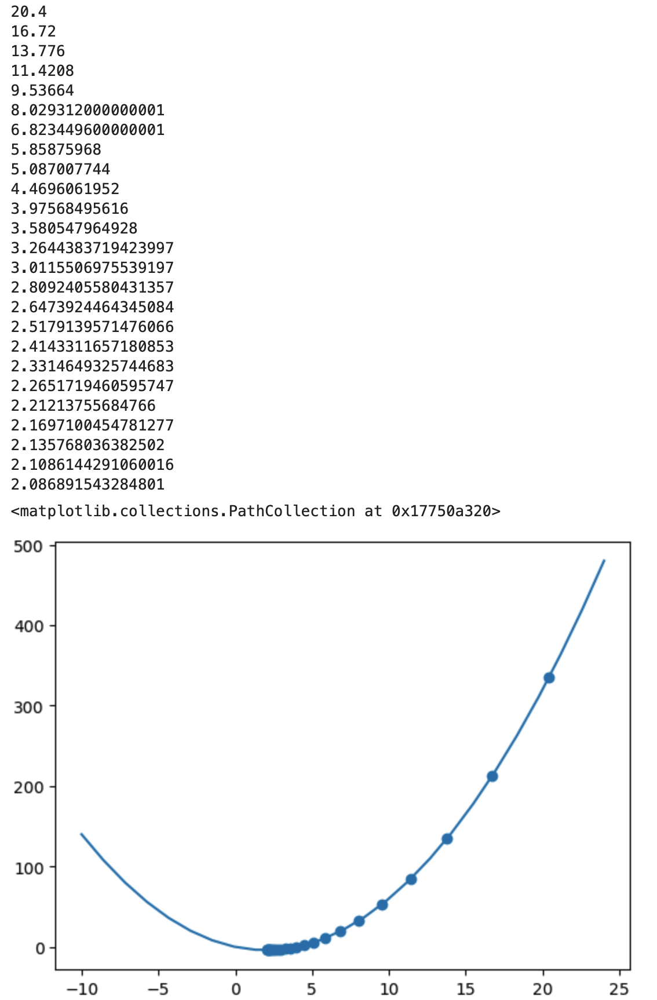

# Basic Gradient Descent 
I learned how to code a program that gets me to the lowest point on a 2d line.

This is the most basic form of gradient descent. Gradient descent is all about getting from a high place on a graph to a low place, while still following the curve of the line. this code has no parameters (m or b), and 1 feature.

# Mountain Example

Lets say you are blindfolded on top of a mountain. Your goal is to get to the bottom of the mountain. You don't know where to go, so you move yourself slightly in one direction. If you feel it dropping off, you go in that direction. If it slopes up, you try in another direction. This is essentially what gradient descent does.

# Picture of Gradient Descent

As you can see, the numbers start out with big jumps on the mountain, getting smaller and smaller, until they centralize around 2, which is the smallest point on the mountain (or graph).
